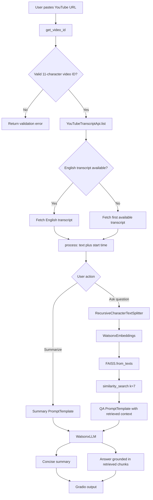
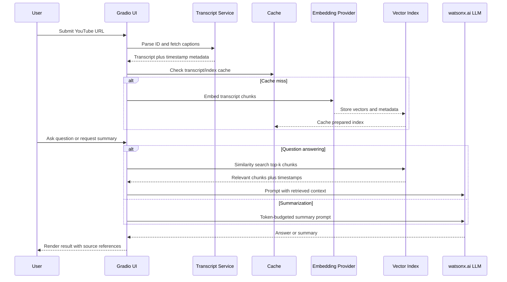

# YouTube Intelligence & RAG Assistant

A Gradio-based YouTube transcript intelligence application that can generate a concise video summary and answer questions grounded in the video's transcript. The application combines YouTube subtitle extraction, transcript normalization, recursive text chunking, IBM watsonx.ai generation, IBM multilingual embeddings, FAISS similarity search, LangChain prompt orchestration, and a browser-based Gradio interface.

> **Project positioning:** This is a serious learning and portfolio project demonstrating an end-to-end Generative AI and Retrieval-Augmented Generation (RAG) pipeline. It is not presented as a production SaaS system yet. The current implementation is intentionally compact and useful for experimentation, demos, and architecture learning.

## Features

The application exposes two user workflows through one Gradio interface.

| Workflow | What it does | Main implementation path |
|---|---|---|
| Video summarization | Extracts a transcript and asks an IBM watsonx.ai language model to produce one concise paragraph. | `summarize_video()` → transcript extraction → transcript formatting → `LLMChain.invoke()` |
| Transcript question answering | Splits the transcript into chunks, embeds those chunks, indexes them in FAISS, retrieves the most similar chunks for a question, and sends the retrieved context to the language model. | `answer_question()` → chunking → embeddings → FAISS → similarity search → `LLMChain.invoke()` |
| Multi-format YouTube URL parsing | Supports standard watch URLs, shortened `youtu.be` URLs, embed-style URLs, Shorts-style URLs, and 11-character video IDs. | `get_video_id()` |
| Transcript language fallback | Searches for an English transcript first and falls back to the first available transcript when English is unavailable. | `get_transcript()` |
| Local web UI | Provides a red-themed Gradio interface with tabs for summarization and RAG-based Q&A. | `gr.Blocks()` and event callbacks |

## Architecture at a glance

The system is organized as five logical layers inside the single `ytbot.py` file:

1. **Input and transcript layer** validates the submitted URL, extracts the YouTube video ID, requests available captions, and selects a transcript.
2. **Normalization and chunking layer** converts transcript snippets into plain text and splits that text into overlapping chunks suitable for retrieval.
3. **Model and vector layer** initializes IBM watsonx.ai generation, IBM multilingual embeddings, and a local FAISS index.
4. **Prompt and chain layer** defines separate summarization and question-answering prompts and invokes LangChain chains.
5. **Presentation and state layer** connects Gradio buttons to Python callbacks and stores the latest transcript in module-level variables.



## Detailed request lifecycle

### 1. URL parsing

`get_video_id(url)` first rejects an empty value. It then applies a regular expression designed to identify common YouTube URL forms. A valid YouTube video ID is normally an 11-character token containing letters, digits, underscores, or hyphens. If no ID is found, the function returns `None`, and the UI returns a user-facing validation message instead of calling the transcript service.

The parser is deliberately defensive because users may paste a full URL containing tracking parameters, a shortened URL, an embed URL, or a Shorts URL. The parser does not download video bytes; it only extracts the identifier needed by the transcript API.

### 2. Transcript retrieval

`get_transcript(url)` converts the URL into a video ID and creates a `YouTubeTranscriptApi` client. It calls `list(video_id)` to discover available caption tracks. The first pass searches for a language code containing `en`. If an English track is not found, the second pass fetches the first track returned by the service. This fallback makes the demo more usable for multilingual videos, but it also means the fallback language is not explicitly selected by the user.

Transcript retrieval can fail when a video has no captions, captions are disabled, the video is unavailable, the transcript endpoint changes, the request is rate-limited, or the selected transcript cannot be fetched. The current code catches the exception, prints a debug message, and returns `None`.

### 3. Transcript normalization

`process(transcript)` converts caption objects into a plain string. For modern transcript objects it reads `i.text` and `i.start`. For dictionary-shaped objects it falls back to `i['text']` and `i['start']`. Each record is rendered in the form:

```text
Text: spoken sentence Start: 12.4
```

The current implementation preserves the start time in the intermediate text. The summarization prompt tells the model to ignore timestamps. For retrieval, timestamps remain available as context but are not yet exposed as clickable references in the UI.

### 4. Summarization path

When the user presses **Generate Video Summary**, `summarize_video(video_url)` performs these steps:

1. Validate that a URL was supplied.
2. Fetch the transcript.
3. Normalize the transcript into one string.
4. Initialize the IBM watsonx.ai model configuration.
5. Create a summarization `PromptTemplate`.
6. Build an `LLMChain`.
7. Invoke the chain with the complete processed transcript.
8. Return the model's text to the Gradio output field.

The model is configured in `setup_credentials()` as `mistralai/mistral-small-3-1-24b-instruct-2503`. The generation parameters use greedy decoding and a maximum of 900 new tokens. Greedy decoding chooses the highest-probability next token at every generation step, which generally makes a demo more deterministic than sampling, although it can be less diverse.

### 5. RAG question-answering path

When the user asks a question, `answer_question(video_url, user_question)` first checks whether a question exists. If no transcript has already been loaded in the module-level state, it tries to fetch and process the supplied URL. It then performs the following RAG sequence:

1. Split the processed transcript using `RecursiveCharacterTextSplitter` with `chunk_size=200` and `chunk_overlap=20`.
2. Initialize IBM's multilingual embedding model `ibm/granite-embedding-278m-multilingual`.
3. Convert every chunk into an embedding vector.
4. Build an in-memory FAISS index with `FAISS.from_texts(...)`.
5. Embed the user's question through the vector-store retriever.
6. Run `similarity_search(query, k=7)` to retrieve seven relevant documents.
7. Join their `page_content` values into one context string.
8. Insert the context and question into the QA prompt.
9. Invoke the IBM watsonx.ai language model.
10. Return the answer to the Gradio output.

Conceptually, each text chunk becomes a vector \(x_i\) in an embedding space. The question becomes another vector \(q\). FAISS searches for chunks whose vectors are close to \(q\) according to the configured similarity metric. The language model does not receive the entire transcript in the QA path; it receives the top retrieved chunks. That retrieval step is what makes the workflow RAG rather than a plain prompt-only question-answering call.

The present implementation rebuilds the chunk list, embedding model, and FAISS index for each question. That is simple and easy to understand, but it is computationally wasteful. A stronger version would cache the index per video ID and invalidate it only when the source transcript changes.

## Model and service configuration

The current source sets the IBM watsonx.ai region URL directly:

```python
credentials = Credentials(url="https://us-south.ml.cloud.ibm.com")
project_id = "skills-network"
```

The source does not hard-code an API key. Authentication therefore depends on the IBM watsonx.ai SDK's supported credential discovery and the runtime environment in which the application is launched. Before running the project, configure IBM watsonx.ai credentials according to the official SDK and platform instructions, then provide a valid project ID with permission to call the selected foundation model and embedding model.

For a public deployment, do not place API keys inside `ytbot.py`, the README, a browser bundle, a screenshot, or a committed `.env` file. Secrets must remain in the deployment platform's encrypted environment-variable settings or in the local machine's secret store.

## Installation

The project targets Python 3.10 or newer. Python 3.11 is a sensible development choice, but the exact compatibility of the IBM SDK and FAISS wheel should be checked in the target deployment environment.

```bash
git clone https://github.com/YOUR_GITHUB_USERNAME/youtube-intelligence-rag-assistant.git
cd youtube-intelligence-rag-assistant
python -m venv .venv

# Linux/macOS
source .venv/bin/activate

# Windows PowerShell
# .venv\\Scripts\\Activate.ps1

python -m pip install --upgrade pip
pip install -r requirements.txt
python ytbot.py
```

After launch, open the local Gradio URL printed in the terminal. The code explicitly binds to `0.0.0.0` on port `7860` and requests a Gradio share URL with `share=True`. The share URL is temporary and should not be treated as a production deployment.

## Runtime flow in code

The source file is intentionally a single-file prototype. The following map points to the principal functions:

| Function | Responsibility | Inputs | Output |
|---|---|---|---|
| `get_video_id` | Parse a YouTube URL or ID. | `url` | Video ID or `None` |
| `get_transcript` | Discover and fetch captions. | YouTube URL | Transcript objects or `None` |
| `process` | Normalize transcript records. | Transcript objects | Plain text string |
| `chunk_transcript` | Create overlapping retrieval chunks. | Text, chunk settings | List of strings |
| `setup_credentials` | Define model, IBM URL, client, and project. | None | Model configuration tuple |
| `define_parameters` | Configure decoding and token limit. | None | Parameter dictionary |
| `initialize_watsonx_llm` | Construct the LangChain IBM LLM wrapper. | Model configuration | `WatsonxLLM` |
| `setup_embedding_model` | Construct multilingual embeddings. | IBM credentials and project | `WatsonxEmbeddings` |
| `create_faiss_index` | Build an in-memory vector index. | Chunks and embeddings | FAISS vector store |
| `retrieve` | Retrieve top-k similar chunks. | Question and index | Document list |
| `summarize_video` | Orchestrate summary generation. | Video URL | Summary or error text |
| `answer_question` | Orchestrate RAG question answering. | Video URL and question | Answer or error text |

## Important implementation limitations

The project is functional as a compact demo, but several design decisions should be changed before calling it production-ready.

### Global state is not multi-user safe

The variables `fetched_transcript` and `processed_transcript` are module-level globals. In a local single-user demo this is understandable. In a shared deployment, one user's transcript can overwrite another user's transcript because all sessions may execute the same Python process. The production fix is to use Gradio session state or a request-scoped state object keyed by session and video ID.

### The FAISS index is rebuilt for every question

The Q&A callback recreates chunks, embeddings, and the FAISS index each time. This causes repeated embedding calls and increases latency and cost. The superior design is to cache a prepared index keyed by the video ID plus transcript hash. The cache should have a bounded lifetime and a memory limit.

### The complete transcript is sent to the summarization model

The summary path passes the entire processed transcript to the model. Long videos may exceed model context limits or become expensive. A production summarizer should use map-reduce summarization, hierarchical summarization, or a token-aware truncation policy. The application should also display a clear notice when a transcript is too long.

### Retrieval is not currently persistent

FAISS is created in memory and disappears when the process stops. This is appropriate for a lightweight demonstration but not for a reusable knowledge base. Persisting indexes would require a storage strategy, metadata for chunk provenance, and lifecycle management.

### Answers do not expose source timestamps

The intermediate text contains start times, but the UI does not return citations or clickable links to the exact transcript segment. A better implementation would store metadata such as `video_id`, `start`, `duration`, and `chunk_index`, then return those metadata records beside the answer.

### Error handling is basic

Exceptions are printed to standard output and converted into generic error text. A stronger service would distinguish invalid URLs, unavailable captions, rate limits, authentication failures, model errors, vector-index failures, and timeouts. It would also use structured logging with request IDs while ensuring transcript content and credentials are not logged.

### Legacy LangChain chain APIs are used

The source uses `LLMChain`, which is retained for compatibility in the dependency range but is a legacy orchestration style in newer LangChain code. A future refactor can use runnable sequences with explicit input and output contracts. That refactor should be tested carefully because the current IBM wrapper response handling supports both dictionary and plain-string responses.

### The IBM project ID is hard-coded

`project_id = "skills-network"` is part of the current source. This may work only in the original learning environment. For personal deployment, move the project ID to an environment variable and validate it at startup.

### The regular expression should be regression-tested

The URL parser covers the intended common formats, but URL parsing is a boundary-sensitive component. Add unit tests for watch URLs with query parameters, `youtu.be` URLs, embed URLs, Shorts URLs, raw IDs, malformed IDs, and unrelated URLs before making parser changes.

## Recommended production architecture

A scalable revision should separate the current monolith into independently testable components:

```text
app/
├── ui.py                 # Gradio or API presentation layer
├── config.py             # Environment-driven settings and validation
├── domain/
│   ├── models.py         # TranscriptChunk, VideoDocument, Answer models
│   └── errors.py         # Typed application exceptions
├── services/
│   ├── youtube.py        # URL parsing and transcript retrieval
│   ├── normalize.py      # Transcript normalization and metadata
│   ├── summarize.py      # Summary strategy and token budgeting
│   ├── embeddings.py     # Embedding provider abstraction
│   ├── retrieval.py      # Chunking, indexing, retrieval, and caching
│   └── answer.py         # Grounded QA orchestration
├── infrastructure/
│   ├── watsonx.py        # IBM SDK construction and retries
│   ├── cache.py           # Redis or local bounded cache
│   └── logging.py         # Privacy-safe structured logging
└── tests/
    ├── test_url_parser.py
    ├── test_transcript_normalizer.py
    ├── test_retrieval.py
    └── test_callbacks.py
```

The request flow for that architecture would be:



## Security and privacy notes

The current application sends transcript-derived text and questions to the configured model provider. Users should avoid processing confidential, copyrighted, or private material unless they have the appropriate rights and understand the provider's data-handling terms. The project should not log full transcripts, API keys, raw authorization headers, or personally identifying data.

For deployment, use environment variables, least-privilege IBM project permissions, dependency pinning, request timeouts, rate limiting, and a maximum transcript size. If the application is exposed publicly, add authentication or a usage-control layer before sharing the URL widely.

## Troubleshooting

| Symptom | Likely cause | Correct action |
|---|---|---|
| `Unable to fetch transcript` | Captions are disabled, unavailable, blocked, or the video ID is invalid. | Test a public video with captions and inspect the printed debug output. |
| IBM authentication error | Credentials or project permissions are missing. | Configure IBM watsonx.ai credentials and verify the project ID and model access. |
| FAISS installation failure | Wheel/platform/Python mismatch. | Use a supported Python version and install the platform-compatible `faiss-cpu` wheel. |
| Empty summary | The transcript was empty or the model returned an unexpected response. | Inspect the transcript length and normalize the model response. |
| Slow Q&A | Embeddings and FAISS are rebuilt for every question. | Implement per-video index caching. |
| Users see each other's context | Module-level globals are shared. | Replace global state with session-scoped state. |
| Model context error on long videos | The entire transcript exceeds the model context budget. | Implement token counting and hierarchical or map-reduce summarization. |

## Testing checklist

Before calling a revision stable, test the following cases:

1. A standard `watch?v=` URL.
2. A `youtu.be` URL with tracking parameters.
3. A Shorts URL.
4. A video with an English transcript.
5. A video with only a non-English transcript.
6. A video with no captions.
7. An invalid URL and an empty URL.
8. A short transcript that can be summarized and queried.
9. A long transcript that approaches the model context limit.
10. Two simultaneous browser sessions to confirm that transcript state is isolated.
11. IBM authentication failure and recovery.
12. A temporary FAISS/index failure.

## Roadmap

The next engineering milestones are to move configuration to environment variables, replace global state with session state, cache transcript-derived indexes, preserve timestamp metadata, add typed errors and structured privacy-safe logs, add automated tests, migrate away from legacy `LLMChain`, introduce token-aware summarization, and deploy behind authentication and rate limits.

## Author and professional profile

Built as a portfolio project by **Umer Rana**, focused on practical AI systems, retrieval workflows, automation, and software engineering foundations.

LinkedIn: [Rana Umer](https://www.linkedin.com/in/rana-umer-05a9a9359/)

## License

No license has been declared yet. Until a license file is added, the repository contents should be treated as **all rights reserved**. Add an explicit open-source license before encouraging reuse or redistribution.
